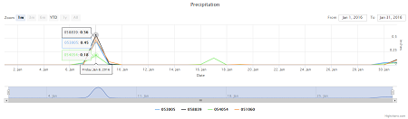
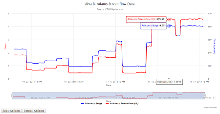

## Timeseries

This folder contains a series of examples of how Highcharts can be used in combination with TSTool to display timeseries data.  While some of the examples are very similar, each adds or highlights a specific aspect of Highcharts visualization that can be used or adapted for future applications.

### Table of Contents

| Preview | Example                    | Description                                                             | Features |
|---------|----------------------------|-------------------------------------------------------------------------|----------|
|                                          | [Simple-Example](simple-example)             | Basic demonstration of how Highcharts works                             |          |
|                                          | Line-Symbology             | Simplified version of TSTool-Line-Symbology                             |          |
|                                          | Simple-Annotations-Example | Basic demonstration of options to customize Time Series chart           |          |
|| TSTool-Small-Data-Example  | Basic demonstration of how to load CSV data into Highcharts             |          |
|| TSTool-Large-Data-Example  | Basic demonstration of how to load bulk CSV data into Highcharts        |          |
|| TSTool-Line-Symbology      | An example of loading configuration data from an external .json file    |          |
|| TSTool-Multiple-Axis       | An example of multiple series on one chart with a separate y-axis       |          |
|| TSTool-Combined-Example    | Example of two charts combined through synchronized zoom and crosshairs |          |
|| TSTool-Dynamic-Example     | Like TSTool-Multiple-Axis, but loads chart title dynamically from URL   |          |
|| TSTool-Category-Axis       | Combined chart example that shows different ways to display wind data   |          |
