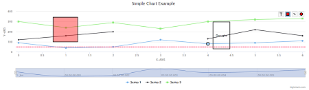

## Timeseries

This folder contains a series of examples of how Highcharts can be used in combination with TSTool to display timeseries data.  While some of the examples are very similar, each adds or highlights a specific aspect of the Highcharts visualization that can be used or adapted for future applications.

### Table of Contents

| Preview Link | Description |
|---------|-------------------------------------------------------------------------|
|
**[Simple-Example](simple-example)**
 | Basic demonstration of how Highcharts works                             |
|
**[Line-Symbology](line-symbology)**
 | Simplified version of TSTool-Line-Symbology                             |
|
**[Simple-Annotations-Example](simple-annotations-example)**
 | Basic demonstration of options to customize Time Series chart           |
|
**[TSTool-Small-Data-Example](TSTool-Small-Data-Example)**
 | Basic demonstration of how to load CSV data into Highcharts             |
|
**[TSTool-Large-Data-Example](TSTool-Large-Data-Example)**
 | Basic demonstration of how to load bulk CSV data into Highcharts        |
|
**[TSTool-Line-Symbology](TSTool-Line-Symbology)**
 | An example of loading configuration data from an external .json file    |
|
**[TSTool-Multiple-Axis](TSTool-Multiple-Axis)**
 | An example of multiple series on one chart with a separate y-axis       |
|
**[TSTool-Combined-Example](TSTool-Combined-Example)**
 | Example of two charts combined through synchronized zoom and crosshairs |
|
**[TSTool-Dynamic-Example](TSTool-Dynamic-Example)**
 | Like TSTool-Multiple-Axis, but loads chart title dynamically from URL   |
|
**[TSTool-Category-Axis](TSTool-Category-Axis)**
 | Combined chart example that shows different ways to display wind data    <ul><li>Uses plotbands to dynamically load day/night cycles</li><li>At specific zoom intervals, chart icons change to represent wind direction</li></ul>|
