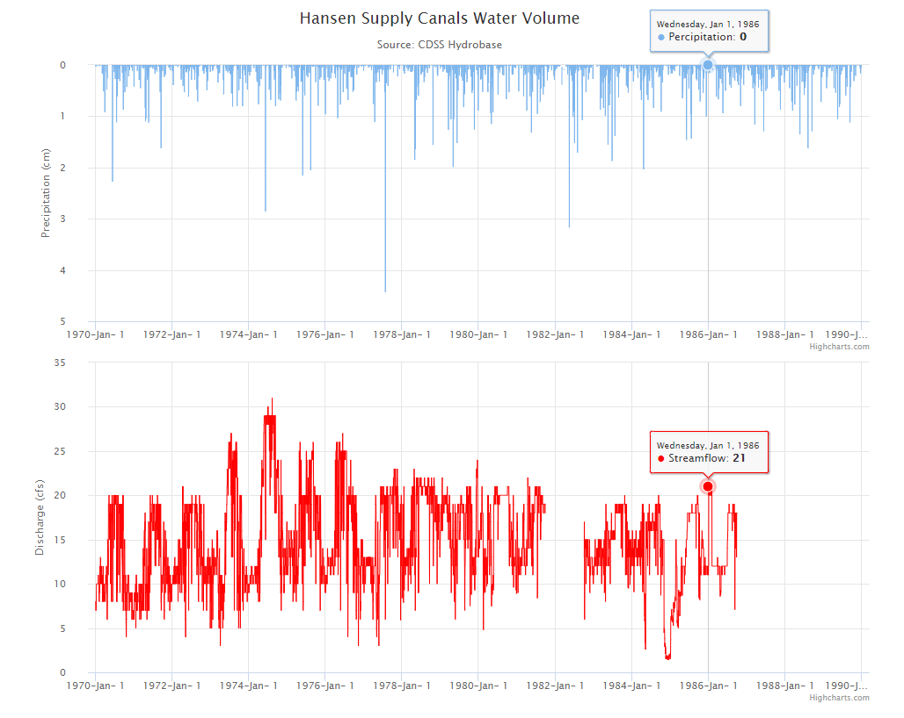

## TS-Tool-Combined-Example



This example demonstrates two charts that share a crosshairs and will synchronize the zoom function.

## File Structure

```
├── TS-Tool-line-symbology
│   ├── README.md
│   ├── index.html
│   ├── css
│   │   ├── highcharts.css
│   ├── javascript
│   │   ├── highstock.js
│   │   ├── data.js
│   ├── build-util
│   │   ├── run-http-server-8000.sh
│   ├── data-files
│   │   ├── config1.json
│   ├── data-prep
│   │   ├── data_prep_new.TSTool
│   │   ├── data_prep_new2.TSTool
│   │   ├── example-streamflow-combined.csv
│   │   ├── example-precipitation-combined.csv
```

## Combined Charts

This combined chart example is actually two seperate charts, each showing data from different csv data files.  They are synchronized through functions that coordinate the crosshairs and tooltip and the syncExtremes function, which coordinates the zoom feature.  When a zoom interval is set by a user on one chart (by clicking and dragging), the syncExtremes function adjusts the interval on the other chart as well through the setExtremes command.  Note that syncExtremes is capable of synchronizing any number of charts, not just two at a time as demonstrated in this example.

```
function syncExtremes(e) {
    var thisChart = this.chart;

    if (e.trigger !== 'syncExtremes') { // Prevent feedback loop
        Highcharts.each(Highcharts.charts, function (chart) {
            if (chart !== thisChart) {
                if (chart.xAxis[0].setExtremes) { // It is null while updating
                    chart.xAxis[0].setExtremes(e.min,e.max,undefined,false,{ trigger: 'syncExtremes' });
                }
            }
        });
    }
}
```

The configuration properties are defined in the external .json file called config1.json. Properties that are shared between the two charts are listed under the 'properties' section, which is applied to all charts with the `Highcharts.setOptions(data.Properties);` command. Properties specific to each chart are listed under properties_1 or properties_2 in config1.json, which are applied with `.update( );` at the end of the jQuery `$.get` command:

```
$.get('data-prep/example-precipitation-combined.csv', function(csvData) {
Highcharts.chart(chartA, {
    data: {
        csv: csvData    // data to be plotted
    },
    //Use the setExtremes function to sync the zoom feature between the two charts
    xAxis: {
        events: {
            setExtremes: syncExtremes
        }
    }
}).update(data.Properties_1);
```

Another useful example can be found [here.](https://www.highcharts.com/demo/synchronized-charts)


## Using an External .json File with External .csv file

When loading data from TSTool as a CSV file, always use the `highcharts.chart` constructor in index.html.  The `highcharts.stockChart` option applies default configuration values that misrepresent data.  The stockChart elements, such as a navigator, can be instead accessed by including them within the constructor itself.  The data must also be loaded directly into the constructor instead of the .json configuration file.  See the following example from [index.html:](https://github.com/OpenWaterFoundation/owf-lib-viz-highcharts-js/blob/master/Timeseries/TS-Tool-line-symbology/index.html)

```
$.get('data-prep/example-streamflow.csv', function(csvData) {
  var myChart = Highcharts.chart('container', {
    data: {
        csv: csvData    // data to be plotted
    },
    navigator: { // update chart based on zoom
      adapToUpdatedData: true,
      enabled: true
    }
  });
  myChart.update(data.Properties);
});
```
