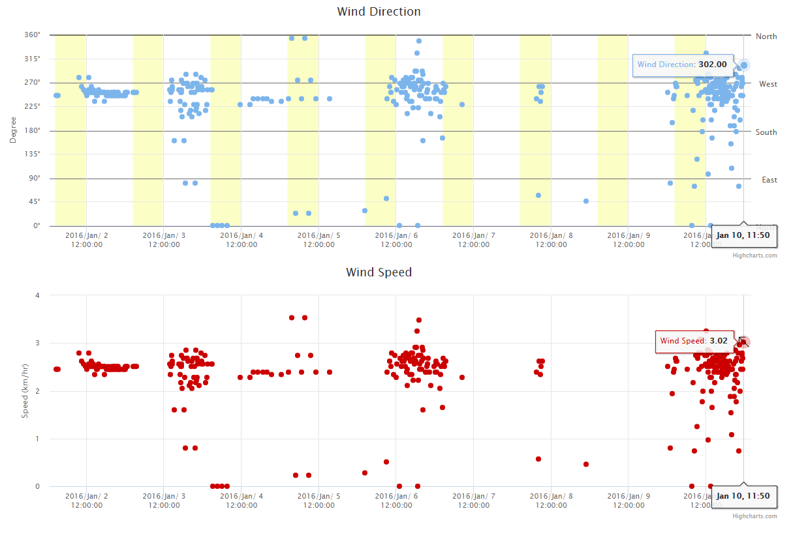
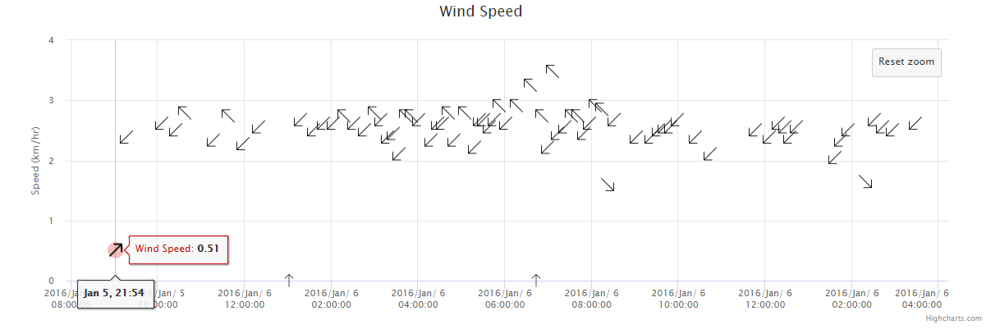

## TS-Tool-Category-Axis



This example demonstrates a combined chart example that shows different ways to display wind data.

## File Structure

```
├── TS-Tool-Category-Axis
│   ├── README.md
│   ├── index.html
│   ├── css
│   │   ├── highcharts.css
│   ├── javascript
│   │   ├── highstock.js
│   │   ├── papaparse.min.js
│   │   ├── data.js
│   ├── build-util
│   │   ├── run-http-server-8000.sh
│   ├── data-files
│   │   ├── config1.json
│   ├── data-prep
│   │   ├── data_prep.TSTool
│   │   ├── stage-discharge-alva-b-adams.csv
```

## Chart One: Wind Direction

The first chart features a dual y-axis, where the left side shows the wind direction as a degree from 0 to 360 and the right side shows cardinal directions.  It also incorporates the Highcharts plotband element to display the day/night cycle as yellow bars on the chart.

Plotband is also used to create the cardinal direction labels on the right side of the graph.  Each horizontal direction line that appears on the graph is actually a plotband with a width of one.

#### Plotting day/night cycles

Within the constructor for the first chart, an additional ajax call utilizes `sunrise-sunset.org` to determine the exact daylight interval for each day of the x-axis.  See the section below from index.html:

```
var maxDate = new Date(myChart1.xAxis[0].getExtremes().max);

//perform the request for sunrise/sunset data
var day;
for (day = 1; day <= maxDate.getDate(); day++){

  var sunrise = "https://api.sunrise-sunset.org/json?lat=40.036380&lng=-105.543600&date=2016-1-" + day + "&formatted=0";

  $.ajax({
      url: sunrise,
      async: false,
      dataType: 'json',
      error: function(error){
          console.log('issue in json')
          //Add plot bands for day/night cycles (default 7am-7pm)
          myChart1.xAxis[0].addPlotBand({
              from: Date.UTC(2016,0,day,7),
              to: Date.UTC(2016,0,day,19),
              color: '#FCFFC5'
          });  
      },
      success: function(data){
          if (data.status != "OK"){
              console.log('data.status is not OK')
              //Add plot bands for day/night cycles (default 7am-7pm)
              myChart1.xAxis[0].addPlotBand({
                  from: Date.UTC(2016,0,day,7),
                  to: Date.UTC(2016,0,day,19),
                  color: '#FCFFC5'
              });
          }
          else {
              //If data is okay, add dynamic plot bands for day/night cycles
              console.log('data.status is OK')
              var mySunrise = data.results.sunrise.substring(
                  data.results.sunrise.indexOf("T") + 1,
                  data.results.sunrise.indexOf("+")
              );

              var mySunset = data.results.sunset.substring(
                  data.results.sunset.indexOf("T") + 1,
                  data.results.sunset.indexOf("+")
              );

              var startTimes = mySunrise.split(':')
              var endTimes = mySunset.split(':')

              myChart1.xAxis[0].addPlotBand({
                  from: Date.UTC(2016,0,day,startTimes[0],startTimes[1],startTimes[2]),
                  to: Date.UTC(2016,0,day,endTimes[0],endTimes[1],endTimes[2]),
                  color: '#FCFFC5'
              });
          }

      }
  })
}
```

Dynamically calling the url `https://api.sunrise-sunset.org/json?lat=40.036380&lng=-105.543600&date=2016-1-" + day + "&formatted=0` returns a .json file with data for a specific day.  Notice how, in the case that this .json data is invalid or returns an error, this code defaults to drawing plotbands from 7AM to 7PM for each day.  If the .json file is valid, it parses the returned `data.results` for sunrise/sunset times, which will appear between the characters `T` and `+` in the returned string.

## Chart Two: Wind Speed

The second chart displays the wind speed at a given time.  However, when zoomed in to a specific interval, it also displays wind direction by replacing each point with vector icons.  When the reset zoom button is triggered, the points revert to the default icons.

#### Dynamically changing point icons



The syncExtremes function keeps track of whenever a zoom event is triggered and synchronizes the extreme values between each chart.  It also checks the new interval of the second chart to determine if it is small enough to display the vector icons, which would be difficult to read when zoomed all the way out.  In this case, the icons only appear when the interval is smaller than 120,000,000 milliseconds, or about 33 hours.  See the partial section below from index.html:

```
$.ajax({
    url: configFile,
    async: false,
    dataType: 'json',
    error: function(error){
        console.log('issue')
    },
    success: function(data){
        console.log("zoom event");
        //Figure out minvalue when a double zoom is performed!!!  Number.MAXVALUE?  or 0?


        if (e.max - e.min < 120000000){
            if ((!(e.min > minVal)) && (e.min != null)){
                console.log("replace minVal")
                minVal = e.min;
            }

            $.ajax({
                url: dataFile,
                async: false,
                dataType: 'text',
                error: function(error){
                    console.log('issue')
                },
                success: function(data){
                    myConfig = Papa.parse(data);
                    for (var i = 0; i < myConfig.data.length; i++){
                        var myDate = new Date(myConfig.data[i][0])

                        if (myDate.valueOf() > e.min && myDate.valueOf() < (e.min + 120000000)){
                            var direction = myConfig.data[i][1]

                            if (direction == 0 || direction == 360){
                                myChart2.series[0].data[i-1].update({
                                    marker: {
                                        symbol: "url(../data-prep/up.png)"
                                    }
                                })
                            }

                            //...etc.
```

This code uses papaParse to read wind direction from 4710-wind-speed.csv.  In addition, consider the line `if (myDate.valueOf() > e.min && myDate.valueOf() < (e.min + 120000000)){`.  Rather than update every icon in the chart (which would take far too long), it only updates the icons that appear between the minimum value and that value plus the interval.  At this point, `myChart2.series[0].data[i-1].update({})` dynamically changes the marker symbol for that data point based on the value of `direction`, which is given from papaParse.

When the values of e.min and e.max are null, this indicates that the reset zoom button has been triggered.  It is important to consider that the zoom feature may be triggered multiple times before this happens, and that the new smaller interval may not encompass all updated symbols.  An additional loop iterates through the points within the largest interval smaller that 120000000 milliseconds (indicated by the variable minVal) and resets the symbols to default:

```
else if (e.max == null && e.min == null){
    for (var i = 0; i < myConfig.data.length; i++){
        var myDate = new Date(myConfig.data[i][0])
        console.log("minVal is: " + minVal)
        if (myDate.valueOf() > minVal && myDate.valueOf() < (minVal + 120000000)){
            console.log("conditional triggered")
            myChart2.series[0].data[i-1].update({
                marker: {
                    symbol: "circle"
                }
            })
        }  
    }
    minVal = Number.MAXVALUE;
    }
```
