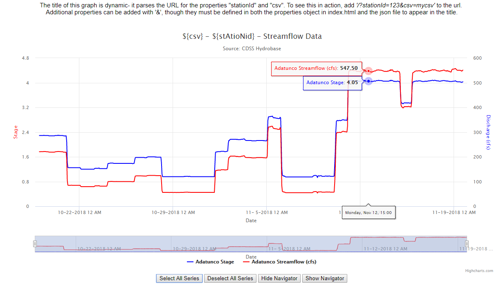

## TSTool-Dynamic-Example



This example is mostly the same as TS-Tool-Multiple-Axis, but it adds dynamic functionality to how the graph loads the title and buttons to select all series and hide the navigator.

This file includes the following sections:

* [File Structure](#file-structure)
* [Parsing URL for Properties](#parsing-url-for-properties)
* [Dynamically Updating Title](#dynamically-updating-title)

## File Structure

```
├── TSTool-line-symbology
│   ├── README.md
│   ├── README-docs                            //contains images for README
│   ├── index.html
│   ├── css
│   │   ├── highcharts.css
│   ├── javascript
│   │   ├── highstock.js
│   │   ├── data.js
│   ├── build-util                             //contains script to run example on local python server
│   │   ├── run-http-server-8000.sh
│   ├── data-files                             //contains external .json file to set highcharts configuration properties
│   │   ├── testfile.html
│   │   ├── config1.json
│   ├── data-prep                              //contains TSTool commands and example csv data set
│   │   ├── data_prep.TSTool
│   │   ├── stage-discharge-alva-b-adams.csv
```

## Parsing URL for properties

With an implementation where the data is loaded from different sources, it may be necessary to dynamically change the title of the graph based on parameters specified in the URL.  To read in the URL as a variable, use the url constructor with the following command:

```
var url = new URL(window.location.href)
```

In this line, `window.location.href` returns the current page address.  Furthermore, the url variable can be parsed with `url.searchParams.get()`.  If a specific parameter occurs in the url, it can be assigned to another variable and added to a properties object.

## Dynamically Updating Title

The command `myChart.update()` can change the title adfter the data has been loaded, according to the properties saved from the URL.  See the following section of code:

```
var newTitle = data.Properties.title.text;
    newTitle = expand_parameter_value(newTitle, properties);
    myChart.update({
        title: {
            text: newTitle
        }
});
```

A new title variable has been created and passed through the expand_parameter_value() function, which replaces values surrounded by delimiters in the title from the .json file with the corresponding values from the URL, as long as they exist.  If the values are not present in the URL, that section of the title is left unchanged.
