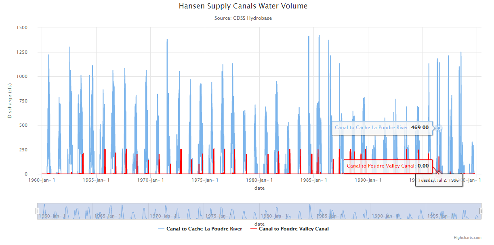

## TS-Tool-line-symbology



This example demonstrates how to utilize CSV water data from TSTool to create a highcharts graph, along with a separate .json configuration file.

## File Structure

```
├── TS-Tool-line-symbology
│   ├── README.md
│   ├── index.html
│   ├── css
│   │   ├── highcharts.css
│   ├── javascript
│   │   ├── highstock.js
│   │   ├── data.js
│   ├── build-util
│   │   ├── run-http-server-8000.sh
│   ├── data-files
│   │   ├── testing1.csv
│   │   ├── config1.json
│   ├── data-prep
│   │   ├── data_prep.TSTool
│   │   ├── example-streamflow.csv
```

## Using an External .json File with External .csv file

When loading data from TSTool as a CSV file, always use the `highcharts.chart` constructor in index.html.  The `highcharts.stockChart` option applies default configuration values that misrepresent data.  The stockChart elements, such as a navigator, can be instead accessed by including them within the constructor itself.  The data must also be loaded directly into the constructor instead of the .json configuration file.  See the following example from [index.html:](https://github.com/OpenWaterFoundation/owf-lib-viz-highcharts-js/blob/master/Timeseries/TS-Tool-line-symbology/index.html)

```
$.get('data-prep/example-streamflow.csv', function(csvData) {
  var myChart = Highcharts.chart('container', {
  	data: {
  			csv: csvData    // data to be plotted
  	},
  	navigator: { // update chart based on zoom
   	 	adapToUpdatedData: true,
   	 	enabled: true
  	}
  });
  myChart.update(data.Properties);
});
```

Additionally, html is not compatible with .json format.  Any html options specifiers, such as tooltip pointFormat, should be specified in the index.html constructor:

```
$.get('data-prep/example-streamflow.csv', function(csvData) {
  var myChart = Highcharts.chart('container', {
    data: {
        csv: csvData    // data to be plotted
    },
    navigator: { // update chart based on zoom
      adapToUpdatedData: true,
      enabled: true
    },
    tooltip: {  // control what the tooltip displays when a user hovers over a data point
      pointFormat: '<span style="color:{series.color}">{series.name}</span>: <b>{point.y}</b>'
    }
  });
  myChart.update(data.Properties);
});
```

For more information about highStock elements, see the online [documentation](https://www.highcharts.com/docs/chart-concepts/understanding-highstock)

## .JSON Options

* Labels on the x-axis may be formatted too close together by default.  To make them more readable, use the `padding` or `step` options.  By default, padding is 5.  Step layers the labels on different lines to make room for more information- specify the number of layers following the option, eg. `"step": 2`
* In the tooltip option, set `split: true` to display the data values for 2 series at once

## Multiple Series

When loading csv data that contains multiple series, highCharts will by default load the name from the header of the csv file as the series name.  To override this, include a series option section in the .json file:

```
"series": [
      {
        "name": "Canal to Cache La Poudre River"
      },
      {
        "name": "Canal to Poudre Valley Canal",
        "color": "red"
      }
    ],
```

Use brackets when setting options for a series.
