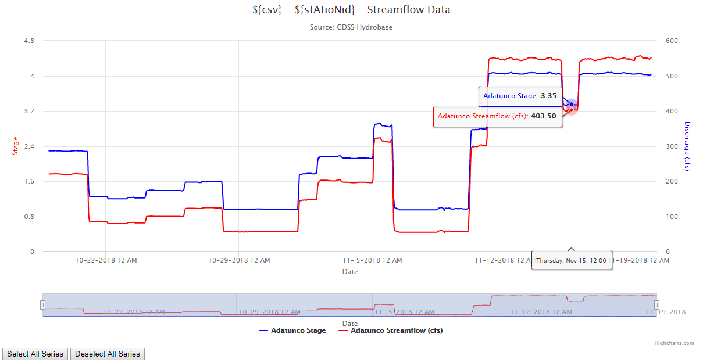

## TS-Tool-Multiple-Axis



Building on the line-symbology example, this example demonstrates how to utilize CSV water data from TSTool to create a highcharts graph, along with a separate .json configuration file.  It incorporates multiple series with a separate y-axis.

## File Structure

```
├── TS-Tool-Multiple-Axis
│   ├── README.md
│   ├── index.html
│   ├── css
│   │   ├── highcharts.css
│   ├── javascript
│   │   ├── highstock.js
│   │   ├── data.js
│   ├── build-util
│   │   ├── run-http-server-8000.sh
│   ├── data-files
│   │   ├── testing1.csv
│   │   ├── config1.json
│   ├── data-prep
│   │   ├── data_prep.TSTool
│   │   ├── stage-discharge-alva-b-adams.csv
```

## Using an External .json File with External .csv file

When loading data from TSTool as a CSV file, always use the `highcharts.chart` constructor in index.html.  The `highcharts.stockChart` option applies default configuration values that misrepresent data.  The stockChart elements, such as a navigator, can be instead accessed by using `Highcharts.setOptions(myConfigFile)` before calling the constructor.  The data itself must be loaded directly into the constructor instead of the .json configuration file.  See the following example from [index.html:](https://github.com/OpenWaterFoundation/owf-lib-viz-highcharts-js/blob/master/Timeseries/TS-Tool-Multiple-Axis/index.html)

```
$(function(){
    //read json configuration properties
    Highcharts.setOptions(data.Properties);
    // jQuery command to get/read file from csv
    $.get('data-prep/stage-discharge-alva-b-adams.csv', function(csvData) {
      var myChart = Highcharts.chart('container', {
        data: {
            csv: csvData    // data to be plotted
        },
      });
      //update properties that depend on data
      myChart.update(data.Properties);

    });
});
```

Additionally, some configuration properties depend on data values and thus must be set after data is read.  To update the chart with these properties, include `myChart.update(myConfigFile)` after data is read inside the constructor, as seen above.

For more information about highStock elements, see the online [documentation](https://www.highcharts.com/docs/chart-concepts/understanding-highstock)

## dateTime Options

Highcharts includes several built-in parsers to deal with dateTime data from CSV files.  However, if the CSV dateTime format does not match one of these formats, a custom parser can deal with this issue.  The example below parses the date column of a CSV file bases on `-` and space, using `dateTime.split(/-| /)`.  Thus, the CSV would include dates such as 2017-01-01 01.

```
data: {
    //custom parser for dateTime
    parseDate: function (dateTime) {
        var arr = dateTime.split(/-| /),
        fullDate = new Date(Date.UTC(arr[0], arr[1], arr[2], arr[3]));
        return fullDate.getTime();
    },
    csv: csvData    // data to be plotted
},
```
Note that the parser is part of the data section in the chart constructor, inside index.html.

## .JSON Options

* Labels on the x-axis may be formatted too close together by default.  To make them more readable, use the `padding` or `step` options.  By default, padding is 5.  Step layers the labels on different lines to make room for more information- specify the number of layers following the option, eg. `"step": 2`
* In the tooltip option, set `split: true` to display the data values for 2 series at once

## Multiple Series

When loading csv data that contains multiple series, highCharts will by default load the name from the header of the csv file as the series name.  To override this, include a series option section in the .json file:

```
"series": [
      {
        "name": "Canal to Cache La Poudre River"
      },
      {
        "name": "Canal to Poudre Valley Canal",
        "color": "red"
      }
    ],
```

Use brackets when setting options for a series.

## Parsing URL for properties

With an implementation where the data is loaded from different sources, it may be necessary to dynamically change the title of the graph based on parameters specified in the URL.  To read in the URL as a variable, use the url constructor with the following command:

```
var url = new URL(window.location.href)
```

In this line, `window.location.href` returns the current page address.  Furthermore, the url variable can be parsed with `url.searchParams.get()`.  If a specific parameter occurs in the url, it can be assigned to another variable and added to a properties object.
