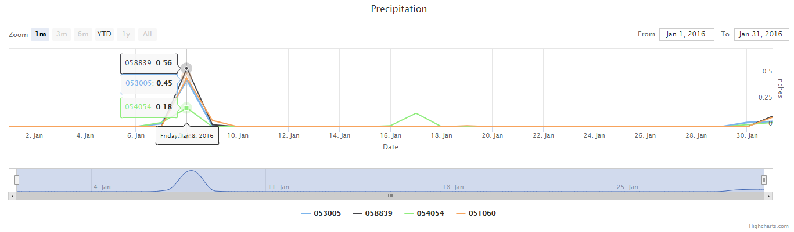

# TSTool-Small-Data-Example



This example is meant to show how to load a small dataset from a CSV (Comma Seperated Value) file. It shows some of the options that can be used to configure and customize a Time Series chart when using a big set of data. Note, in this example the data used is specified within the **URL** option and is created from a TSTool command file. Feel free to start with this example as a template and customize the chart to meet the needs of your visualization project.

## File Structure
```
├── TSTool-Small-Data-Example
│   ├── index.html
│   ├── css
│   │   ├── highcharts.css
│   ├── javascript
│   │   ├── highcharts.js
│   │   ├── highstock.src.js
│   │   ├── data.js
│   ├── TSTool
│   │   ├── Small-Precip.TSTool
│   ├── data-files
│   │   ├── small-precip-data.csv
```

## What is a Timeseries Graph

Timeseries, also known as Line Graphs, are used to display quantitative value over a continuous interval or time span. It is most frequently used to show trends and relationships (when grouped with other lines). Line Graphs also help to give a "big picture" over an interval, to see how it has developed over that period.

Line Graphs are drawn by first plotting data points on a Cartesian coordinate grid, then connecting a line between these points. Typically, the y-axis has a quantitative value, while the x-axis has either a category or sequenced scale. Negative values can be displayed below the x-axis.

For more information refer to the links below:

* [Timeseries Graph](http://www.datavizcatalogue.com/methods/line_graph.html)
* [Timeseries Documenation](https://developers.google.com/chart/interactive/docs/gallery/linechart)

## Additional Documentation

See also:
* [Highchart Documentation](https://www.highcharts.com/docs)
* [Highchart API Reference](http://api.highcharts.com/highcharts)
* [Highstock API Reference](http://api.highcharts.com/highstock/)
* [Highmaps API Reference](http://api.highcharts.com/highmaps/)
* [TSTool](http://openwaterfoundation.org/software-tools/tstool)
